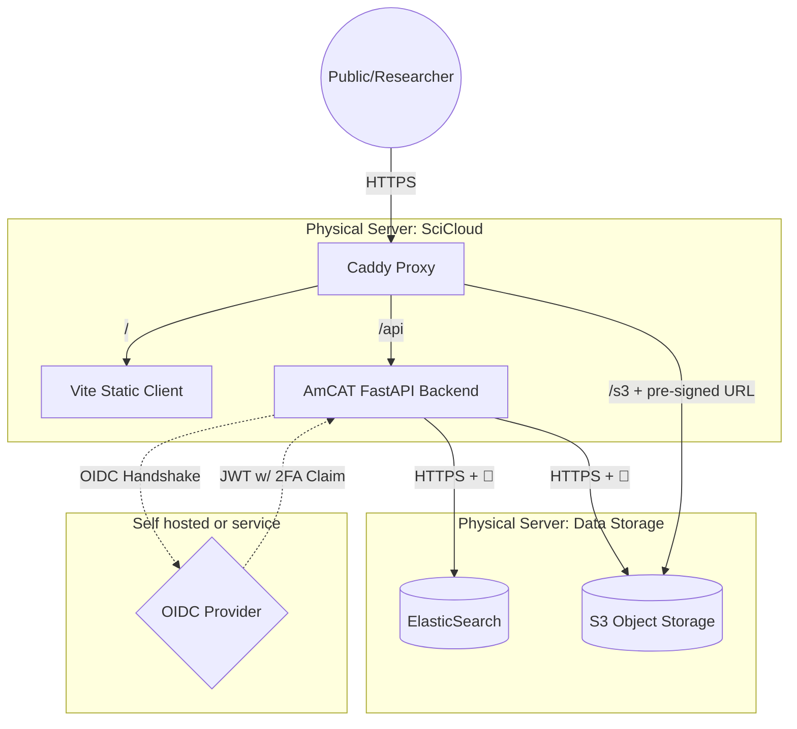

# AmCAT

AmCAT (AMsterdam Content Analysis Toolkit) is an open-source tool for storing, managing, and analyzing research data. 

The architecture centers on a Caddy proxy that handles SSL termination and routing. The FastAPI backend orchestrates data across distributed storage layers.

### Infrastructure Details
* **Proxy:** Caddy serving on Port 443.
* **Frontend:** Vite-built static client served at `/`.
* **Backend API:** FastAPI server mounted at `/api`.
* **Data Storage (ES):** ElasticSearch, used for both metadata and primary textual data storage.
* **Object Storage (S3):** S3-compatible storage for large research files.
* **Deployment Note:** FastAPI, ElasticSearch, and S3 are decoupled and may reside on different physical or virtual servers.

### Data Risks & Compliance
| Field | Value |
| :--- | :--- |
| **Data Category** | GDPR Cat 3 (PII & Research Data) |
| **Exposure Method** | Caddy Proxy (HTTPS) |
| **Authentication** | External OIDC (Delegated) |
| **2FA Status** | **Enforced by IdP** (Sufficient for Lab Policy) |
| **Storage** | ElasticSearch + S3 |
| **Backup** | Daily snapshot to University NAS |

---
**Technical Notes:** 

* Authentication is verified via JWT tokens. As long as the OIDC Provider (IdP) enforces 2FA, the AmCAT FastAPI backend is considered protected by 2FA.

* Browser authenticates via session cookie (signed, http-only, samesite lax) and CSRF token
