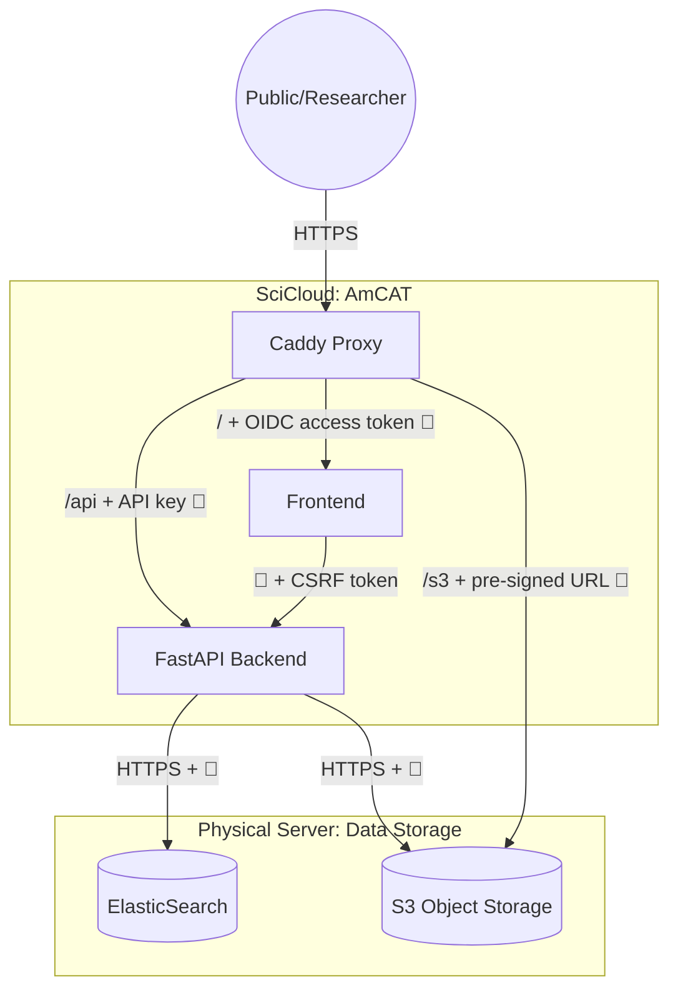
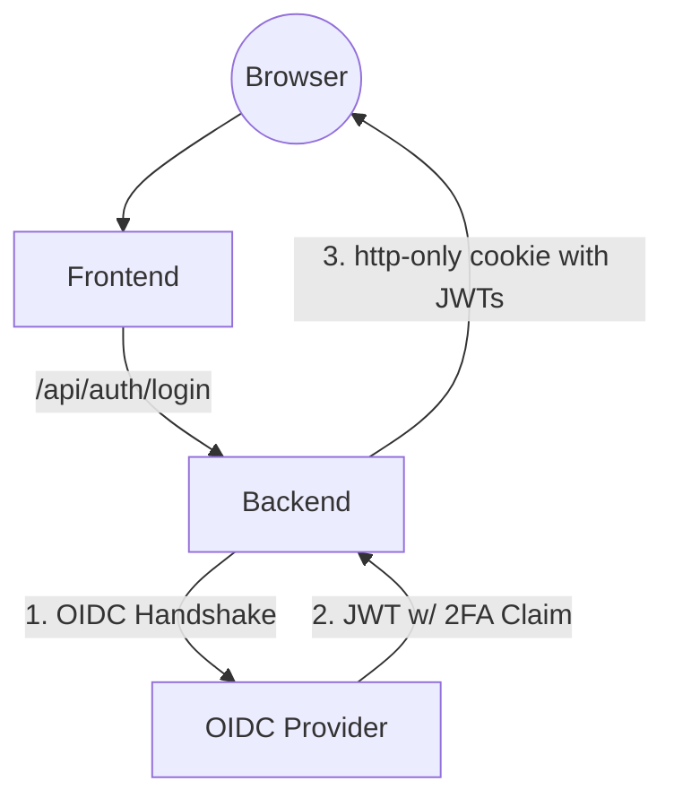
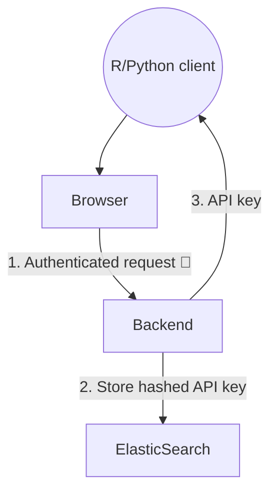

# AmCAT

AmCAT (**Am**sterdam **C**ontent **A**nalysis **T**oolkit) is an open-source tool for storing, managing, and analyzing research data. 

The architecture centers on a Caddy proxy that handles SSL termination and routing. The FastAPI backend 

## Browser authenticates with OIDC

Browser session authentication is managed by an OIDC provider capable of handling enterprise and institutional security requirements. 
The OIDC provider only does authentication: letting users securely prove to AmCAT that they own an email address.

For University hosted AmCAT servers we recommend local hosting Authentic, which offers MFA and synchronizes with LDAP.

## Direct API access authenticates via API keys

For direct API access we use application-managed tokens, decoupling them from the OIDC provider. 
API keys can only be created with an OIDC provider authenticated session. 
(TODO: implement step-up authentication for sensitive actions like creating API keys)

### Infrastructure Details
* **Proxy:** Caddy serving on Port 443.
* **Frontend:** Vite-built React SPA served at `/`.
* **Backend API:** FastAPI server mounted at `/api`.
* **OIDC flow:** Initiated and callback on Backend; tokens set as signed, http-only session cookie
* **Data Storage (ES):** ElasticSearch, used for both metadata and primary textual data storage.
* **Object Storage (S3):** S3-compatible storage for large files.
* **Deployment Note:** FastAPI, ElasticSearch, and S3 are decoupled and may reside on different physical or virtual servers.

### Data Risks & Compliance
| Field | Value |
| :--- | :--- |
| **Data Category** | GDPR Cat 3 (PII & Research Data) |
| **Exposure Method** | Caddy Proxy (HTTPS) |
| **Authentication** | External OIDC (Delegated) |
| **Authorization** | FastAPI backend controlls all DB access |
| **2FA Status** | **Enforced by IdP** (Sufficient for Lab Policy) |
| **Storage** | ElasticSearch + S3 |
| **Backup** | Daily snapshot to University NAS |

---
**Technical Notes:** 

* Authentication is verified via JWT tokens. OIDC provider set to enforce 2FA, and Backend checks 2FA claims to verify.

* Browser authenticates via session cookie (signed, http-only, samesite lax) and CSRF token (signed double submit pattern)
