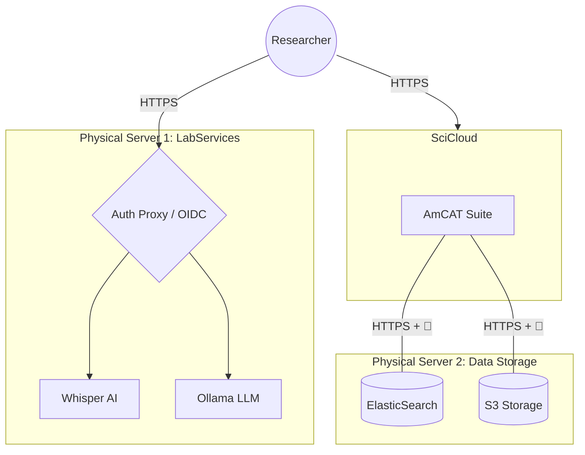

# Lab Infrastructure Registry

This registry serves as the authoritative map for the lab's physical hardware and the research services they host.

---

## 🌐 Infrastructure Landscape
This diagram maps our primary physical servers to the high-level services accessible to researchers.

---

## 🖥️ Physical Assets & Service Ownership

| Physical Server | Hosted Services | Access Level | Primary Purpose |
| :--- | :--- | :--- | :--- |
| **SciCloud** | **[AmCAT](./amcat.md)** | Public / Auth | Main research application & API. |
| **Data Storage** | **ElasticSearch**, **S3** | Internal Only | Backend storage for text and large files. |
| **LabServices** | **Whisper**, **Ollama** | Public / Auth | GPU-accelerated AI inference & transcription. |

---

## 🔐 Security Standards
* **Edge Security:** No service is exposed via plain HTTP. All traffic is TLS-encrypted.
* **Identity:** We use a "Zero Trust" approach where the Caddy/Nginx proxy validates OIDC tokens before traffic reaches the service.
* **2FA:** Multi-factor authentication is required for all researcher logins via the central Identity Provider.
* **Resilience:** All servers perform daily off-site backups to the University NAS.
