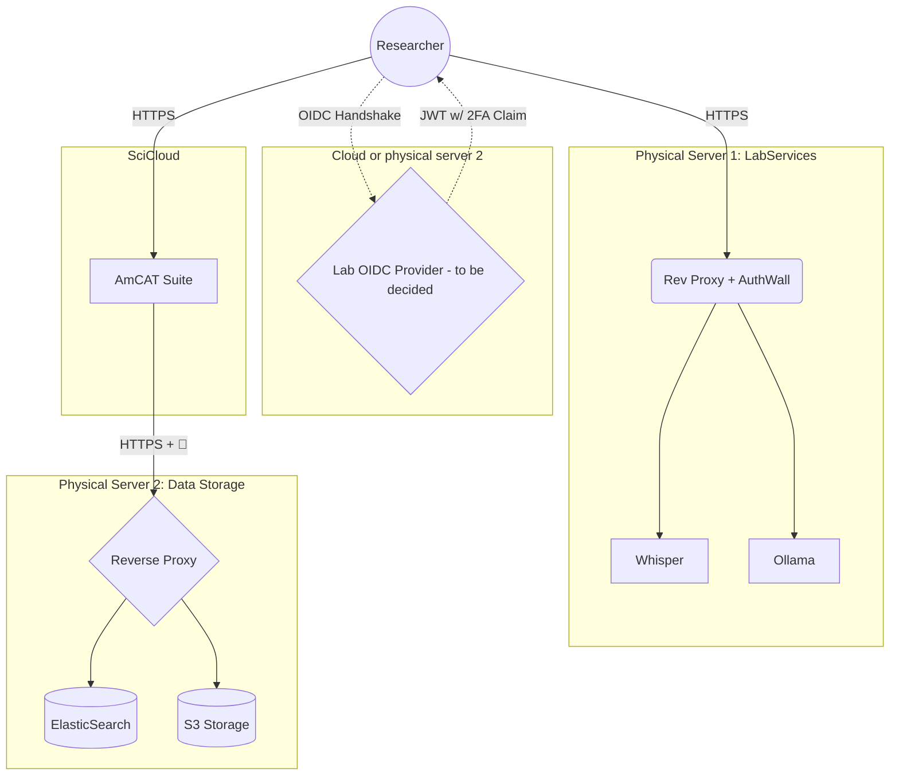

# Lab Infrastructure Registry

This registry serves as the authoritative map for the lab's physical hardware and the research services they host.

---

## 🌐 Infrastructure Landscape
This diagram maps our primary physical servers to the high-level services accessible to researchers.

```mermaid
graph TD
    User((Researcher))
    
    %% Authentication
    subgraph Auth [Cloud or physical server 2]
        IdP{Lab OIDC Provider - to be decided}
    end
    User -.->|OIDC Handshake| IdP
    IdP -.->|JWT w/ 2FA Claim| User

    %% SciCloud Environment
    subgraph SciCloud [SciCloud]
        AmCAT[AmCAT Suite]
    end
    
    %% Physical Server 1
    subgraph LabServices [Physical Server 1: LabServices]
        ProxyLab(Rev Proxy + AuthWall)
        ProxyLab --> Whisper
        ProxyLab --> Ollama
    end

    %% Physical Server 2
    subgraph Storage [Physical Server 2: Data Storage]
        ProxyStorage{Reverse Proxy}
        ES[(ElasticSearch)]
        S3[(S3 Storage)]
    end
    

    %% External Incoming Connections
    User -->|HTTPS| AmCAT
    User -->|HTTPS| ProxyLab

    %% Storage Routing (Internal via Proxy)
    AmCAT -->|HTTPS + 🔑| ProxyStorage
    ProxyStorage --> ES
    ProxyStorage --> S3

    %% Clickable Links
    click AmCAT "./amcat" "View AmCAT Technical Docs"
```

---

## 🖥️ Physical Assets & Service Ownership

| Physical Server | Hosted Services | Access Level | Primary Purpose |
| :--- | :--- | :--- | :--- |
| **SciCloud** | **[AmCAT](./amcat.md)** | Public / Authenticated | Web Application & API for storing, managing and sharing data |
| **Data Storage** | **ElasticSearch**, **S3** | Internal Only | Backend storage for text and large files. |
| **LabServices** | **Whisper**, **Ollama** | Authenticated | GPU-accelerated AI inference & transcription. |
| ==TODO: depends on decision== | **Lab OIDC provider** (to be decided: SRAM, or a self-hosted provider, see the [comparison](./auth-providers.md)) | Lab members and collaborators | Identity provider for lab services, with 2FA. See [Lab authentication](./lab-auth.md). |
| ==TODO: depends on decision== | **Shared OIDC provider** (under review, see the [comparison](./auth-providers.md)) | Public (self-registration) | [Shared provider](./auth-install.md#option-1-our-shared-oidc-provider) for other teams hosting AmCAT or AnnoTinder without sensitive data. Kept separate from the lab OIDC provider. |

---

## 🔐 Security Considerations
* **Edge Security:** No service is exposed via plain HTTP. All traffic is TLS-encrypted.
* **Identity:** We use a "Zero Trust" approach: services without their own OIDC login sit behind a forward-auth AuthWall, which checks the OIDC session before traffic reaches the service (see [Lab authentication](./lab-auth.md)). Our own software (AmCAT, AnnoTinder) follows the [Authentication standard](./auth.md).
* **2FA:** Multi-factor authentication is required for all researcher logins via the lab OIDC provider.
* **Resilience:** All servers perform daily off-site backups to the University NAS.
