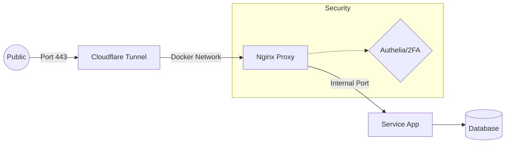

# [Service name]
**Status:** 🟢 Production

### Network Flow

### Data Risks
| Field | Value |
| :--- | :--- |
| **Data Category** | GDPR Cat 3 (PII) |
| **Backup** | Daily to Uni NAS |
| **Auth Type** | LDAP + 2FA |
